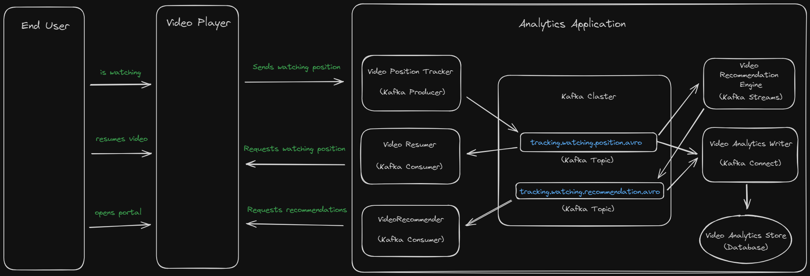
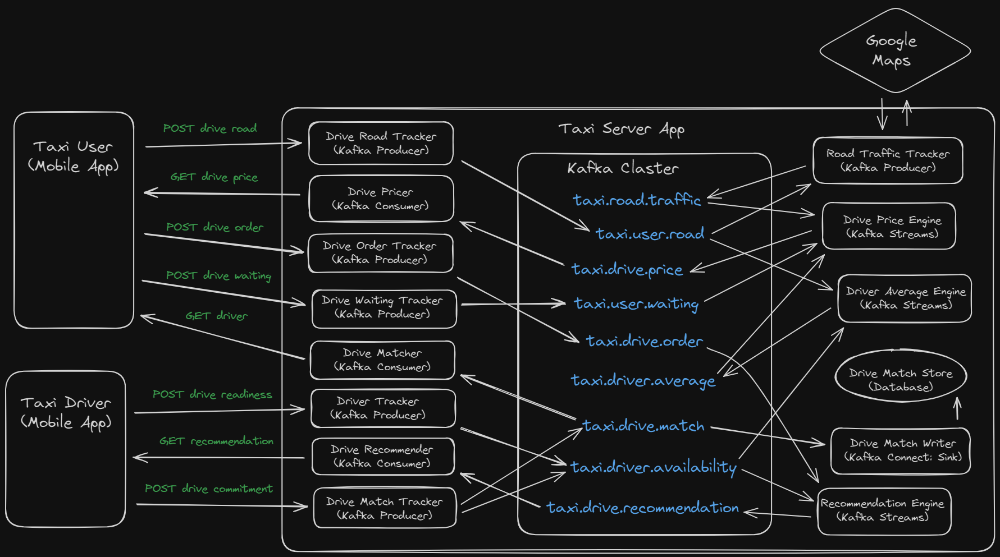

# Apache-Kafka-Demo

Learn and play with Apache Kafka

Implemented based on LinkedIn Learning
course: [Complete Guide to Apache Kafka for Beginners](https://www.linkedin.com/learning/complete-guide-to-apache-kafka-for-beginners)
with related GitHub repository: [conduktor/kafka-beginners-course](https://github.com/conduktor/kafka-beginners-course)

* [Tech Stack](#tech-stack)
* [Short Theory](#short-theory)
* [Software Preparation (Windows OS)](#software-preparation-windows-os)
* [Start Kafka](#start-kafka)
* [Module 1: Basics](#module-1-basics)
* [Module 2: Pet Project](#module-2-pet-project)
* [Module 3: Use Cases](#module-3-use-cases)

## Tech Stack

- Apache Kafka
- Apache ZooKeeper
- Apache Kafka CLI
- Apache Kafka SDK
- Java 17
- Gradle
- Windows 10
- Windows Subsystem for Linux (WSL)
- IntelliJ IDEA (Community edition)

## Short Theory

- **Kafka Cluster** - entire service within microservice app.
- **Topic** - logical part of Kafka Cluster for Event processing.
  Event is some sort of data, e.g. Temperature changing over the time collected by City sensors.
- **Partition** - physical and logical part of Topic.
  When Events come to Topic they are distributed across several Partitions.
  Different Partitions may be located on the same or different physical machines.
- **Kafka Broker** - physical part of Kafka Cluster.
  Only one Broker can be on the same physical machine.
  Broker may contain different Partitions from different Topics.
- **Throughput** - thanks to Topic Partitioning,
  we can have several Clients that use the same Topic, but consume their specific data simultaneously.
- **Scalability** - we can increase performance horizontally by adding new Kafka Brokers
  and rebalancing Partitions.
- **Durability** - each Partition of each Topic is replicated in different Brokers.
  In case one Broker is down, we can continue work with other replicas that are in live Brokers.
  Event is sent to a Leader replica.
  Event may be read from any replica of given Partition.

## Software Preparation (Windows OS)

First, we have to set up WSL and install Kafka and ZooKeeper servers on our machine.

Follow this
instruction: [How to Install Apache Kafka on Windows?](https://www.conduktor.io/kafka/how-to-install-apache-kafka-on-windows/)

Used version `kafka_2.13-3.7.0`

Additionally, we have to set up `listeners` value in `~/kafka_2.13-3.7.0/config/server.properties` file:

run `nano ~/kafka_2.13-3.7.0/config/server.properties`

find, uncomment and update `listeners` value to `PLAINTEXT://[::1]:9092`

We will use it as `--bootstrap-server` for Kafka CLI and `bootstrap.servers` for Java SDK.

## Start Kafka

Start local services for Zookeeper and Kafka:

In first Ubuntu window run `zookeeper-server-start.sh ~/kafka_2.13-3.7.0/config/zookeeper.properties`

In second Ubuntu window run `kafka-server-start.sh ~/kafka_2.13-3.7.0/config/server.properties`

## Module 1: Basics

There are common concepts of Kafka implementation in practice.
We will use command line interface as well as java programming.

Follow this [link](Apache-Kafka-Basics/README.md) to check README file of this module.

## Module 2: Pet Project

There is use case where we play with Kafka in real project scenario.

Follow this [link](Wikimedia-Pet-Project/README.md) to check README file of this module.

## Module 3: Use Cases

Overview of Kafka applications in real world projects. 
We consider cases where important point is high data load meaning app has a lot of End Users
that actively produce and consume data in real time.  

#### 1. Movie Analytics app

**Problem:** There is company that has TV Shows and Movies streaming platform like Netflix.
They would like to have new feature: analytics app that will improve User experience.
Requirements are next:
- Users should be able to resume the video where they left if off
- Recommend the next show to the User
- Store history of watching and recommendations

**Solution:** 
implement data processing based on Kafka Cluster, Java Microservices (Kafka Producers, Consumers, Streams), Kafka Connect (Sink Connector).

The entire project will look like this:

Where components are:
- `VideoPlayer` - existing app that the company already has in production.
- `tracking.watching.position.avro` - new Kafka Topic with Events of watching position change.
   May have `user_id` as Event key, `
- `VideoPositionTracker` - new Java Microservice that plays role of Kafka Producer: 
   when User is watching Video, `VideoPositionTrasker` receives Events of watching position change from `VideoPlayer` service and writes it to `tracking.watching.position.avro`
- `VideoResumer` - new Java Microservice that plays role of Kafka Consumer: 
   when User resumes Video, `VideoResumer` returns current watching position from `tracking.watching.position.avro` to `VideoPlayer` service
- `tracking.watching.recommendation.avro` - new Kafka Topic to process Events of watching recommendation change.
   May have `user_id` as Event key.
- `VideoRecommendationEngine` - new Java Microservice that uses Kafka Streams API:
   based on Events in `tracking.watching.position.avro` writes Events to `tracking.watching.recommendation.avro`.
   Assumed following business idea: the more amount of time Video was watched (e.g. just first 5 mins or full 2 hours?) the more similar Videos will be recommended.  
- `VideoRecommender` - new Java Microservice that plays role of Kafka Consumer:
   when User opens Movie portal, `VideoRecommender` returns list of recommended videos from `tracking.watching.recommendation.avro` to `VideoPlayer` service
- `VideoAnalyticsStore` - new Database service to store Events from `tracking.watching.position.avro` and `tracking.watching.recommendation.avro`
- `VideoAnalyticsWriter` - new Microservice that plays role of Kafka Connect (Sink Connector):
   consumes Events from `tracking.watching.position.avro`, `tracking.watching.recommendation.avro` and saves them to `VideoAnalyticsStore`

#### 2. Get Taxi app

**Problem:** There is a startup company that has a growing demand for Taxi services in their country, 
so, they are going to implement Get Taxi app like Uber. 

Currently, the company develops Mobile applications for Taxi User and Taxi Driver.
We are invited as Back-End professionals and our goal is to develop solution with "before drive" functionality:

- When Taxi User chooses Drive Road, calculate Drive Price 
  based on average Taxi Driver Rate (in near location) and Road Traffic. 

- When Taxi User agrees with the Drive Price and submits Drive Order, 
  find the best match with Taxi Driver based on Taxi Driver Location.

- When Taxi Driver becomes free and submits readiness for the next Drive Order, 
  suggest the best match with Taxi User based on Taxi User Location and Drive Price.

- When Taxi User is waiting for the Taxi Driver to be found, 
  suggest Taxi User to increase Drive Price by amount calculated based on time spent on waiting.

- When Taxi Driver commits for a Drive Order, 
  then we assume that goal is archived successfully: our app has found match between User and Driver,
  so, Drive has started, and we have to save it to DB.

We should consider that Mobile applications have next API:

- When Taxi User submits Drive Road,
  then Taxi User mobile app sends asynchronous HTTP POST request to check Drive Price.
  The content in this POST request is Drive Road which contains User ID, Start Location, Finish Location.
  Drive Road may be frequently changed data:
  Taxi User may play with different Roads to find the best Price or just change plans. 

- While server is processing Drive Price,
  Taxi User mobile app has background process
  that makes regular HTTP GET requests to receive the latest Drive Price.
  That means Taxi User can wait for comfortable Drive Price.

- When Taxi User got some Drive Price and commits it,
  then Taxi User mobile app sends asynchronous HTTP POST request to make Drive Order.
  Drive Order is content of this POST request and contains User ID, Start Location, Finish Location, Price.
  
- While Taxi User is waiting for Drive Order to be picked by Taxi Driver, 
  Taxi User mobile app has background process 
  that makes regular asynchronous HTTP POST requests to receive suggestions about Price increasing.
  Content of this POST request is User ID and amount of waiting time. 
  If Taxi User agrees to increase Price,
  Taxi User mobile app cancels previous Drive Order POST request and make new one (as described above)

- When Taxi Drive becomes ready for new Drive Order,
  Taxi Drive mobile app sends asynchronous HTTP POST request to submit availability.

- While server is searching Drive Order for Taxi Driver,
  Taxi Driver mobile app has background process
  that makes regular HTTP GET requests to receive the better Drive Order.
  That means Taxi Driver can wait for comfortable Drive Order.

- When Taxi Driver got some Drive Recommendation and commits it,
  then Taxi Driver mobile app sends synchronous HTTP POST request to make Drive Match.
  Drive Match is content of this POST request and contains Driver ID, User ID, Start Location, Finish Location, Price.

**Solution:**
Implement data processing based on Kafka Cluster, Java Microservices (Producers and Consumers), Kafka Streams, Kafka Connect.

The entire project will look like this:

