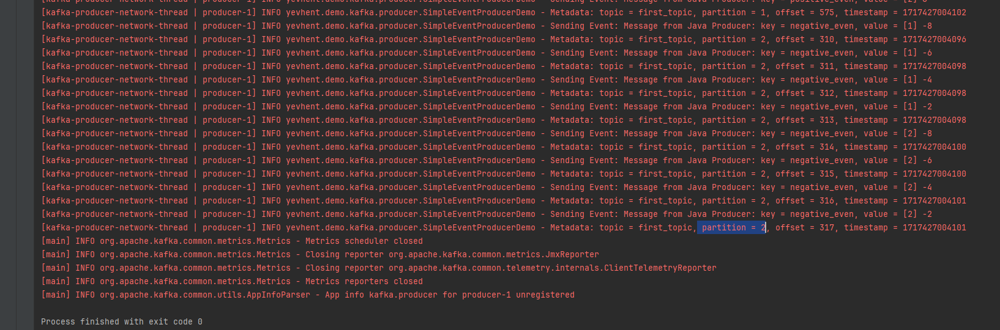
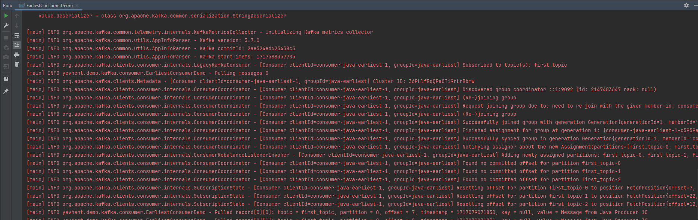
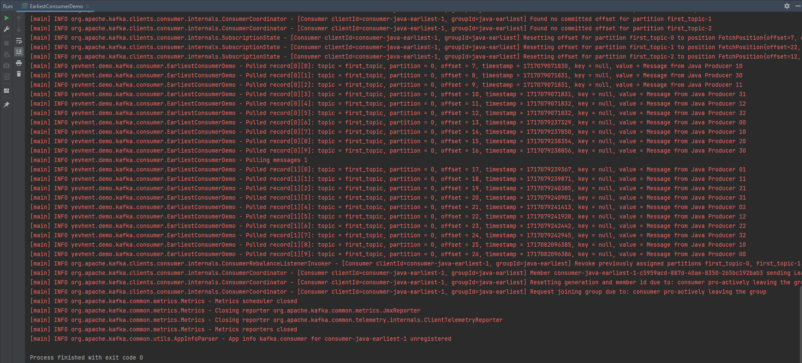

# Apache-Kafka-Demo

Learn and play with Apache Kafka

Implemented based on LinkedIn Learning
course: [Complete Guide to Apache Kafka for Beginners](https://www.linkedin.com/learning/complete-guide-to-apache-kafka-for-beginners)

* [Tech Stack](#tech-stack)
* [Short Theory](#short-theory)
* [Software Preparation (Windows OS)](#software-preparation-windows-os)
* [Start Kafka](#start-kafka)
* [Kafka CLI: Topics](#kafka-cli-topics)
* [Kafka CLI: Event Sending](#kafka-cli-event-sending)
* [Kafka CLI: Event Receiving](#kafka-cli-event-receiving)
    * [Consumer](#consumer)
    * [Consumer Group](#consumer-group)
    * [Consumer Offset](#consumer-offset)
* [Java SDK: Event Sending](#java-sdk-event-sending)
    * [Simple Event](#simple-event)
    * [Event Stream](#event-stream)
    * [Events Distribution](#events-distribution)
    * [Events with Keys](#events-with-keys)
    * [Events with Keys partitioning](#events-with-keys-partitioning)
    * [Events with null Keys](#events-with-null-keys)
* [Java SDK: Event Receiving](#java-sdk-event-receiving)
    * [Earliest Consumer](#earliest-consumer)
    * [Latest Consumer](#latest-consumer)
    * [Durable Consumer](#durable-consumer)
    * [Consumer Group Rebalancing](#consumer-group-rebalancing)

## Tech Stack

- Apache Kafka
- Apache ZooKeeper
- Apache Kafka CLI
- Apache Kafka SDK
- Java 17
- Gradle
- Windows 10
- Windows Subsystem for Linux (WSL)
- IntelliJ IDEA (Community edition)

## Short Theory

- **Kafka Cluster** - entire service within microservice app.
- **Topic** - logical part of Kafka Cluster for Event processing.
  Event is some sort of data, e.g. Temperature changing over the time collected by City sensors.
- **Partition** - physical and logical part of Topic.
  When Events come to Topic they are distributed across several Partitions.
  Different Partitions may be located on the same or different physical machines.
- **Kafka Broker** - physical part of Kafka Cluster.
  Only one Broker can be on the same physical machine.
  Broker may contain different Partitions from different Topics.
- **Throughput** - thanks to Topic Partitioning,
  we can have several Clients that use the same Topic, but consume their specific data simultaneously.
- **Scalability** - we can increase performance horizontally by adding new Kafka Brokers
  and rebalancing Partitions.
- **Durability** - each Partition of each Topic is replicated in different Brokers.
  In case one Broker is down, we can continue work with other replicas that are in live Brokers.
  Event is sent to a Leader replica.
  Event may be read from any replica of given Partition.

## Software Preparation (Windows OS)

First, we have to set up WSL and install Kafka and ZooKeeper servers on our machine.

Follow this
instruction: [How to Install Apache Kafka on Windows?](https://www.conduktor.io/kafka/how-to-install-apache-kafka-on-windows/)

Used version `kafka_2.13-3.7.0`

Additionally, we have to set up `listeners` value in `~/kafka_2.13-3.7.0/config/server.properties` file:

run `nano ~/kafka_2.13-3.7.0/config/server.properties`

find, uncomment and update `listeners` value to `PLAINTEXT://[::1]:9092`

We will use it as `--bootstrap-server` for Kafka CLI and `bootstrap.servers` for Java SDK.

## Start Kafka

Start local services for Zookeeper and Kafka:

In first Ubuntu window run `zookeeper-server-start.sh ~/kafka_2.13-3.7.0/config/zookeeper.properties`

In second Ubuntu window run `kafka-server-start.sh ~/kafka_2.13-3.7.0/config/server.properties`

## Kafka CLI: Topics

Having Zookeeper and Kafka running, we can create new Topic.

In third Ubuntu window
run `kafka-topics.sh --bootstrap-server [::1]:9092 --topic first_topic --create --partitions 3 --replication-factor 1`

As we are using localhost, `replication-factor` can't be more than 1 (number of server machines).

Then check Topics, run `kafka-topics.sh --bootstrap-server [::1]:9092 --list`

Then describe Topic, run `kafka-topics.sh --bootstrap-server [::1]:9092 --topic first_topic --describe`

Output looks like this:

|                    |                                 |                   |                      |          |
|--------------------|---------------------------------|-------------------|----------------------|----------|
| Topic: first_topic | TopicId: BfQ0D9GXRWufAz0zyzPrhQ | PartitionCount: 3 | ReplicationFactor: 1 | Configs: |

|                    |              |           |             |        |
|--------------------|--------------|-----------|-------------|--------|
| Topic: first_topic | Partition: 0 | Leader: 0 | Replicas: 0 | Isr: 0 |
| Topic: first_topic | Partition: 1 | Leader: 0 | Replicas: 0 | Isr: 0 |
| Topic: first_topic | Partition: 2 | Leader: 0 | Replicas: 0 | Isr: 0 |

## Kafka CLI: Event Sending

Having Topic named `first_topic` we can write Events to cmd.
To open input, run `kafka-console-producer.sh --bootstrap-server [::1]:9092 --topic first_topic`

Now we can send Event by typing text and clicking Enter. Each text line represents 1 Event (message).
To exit input click combination `ctrl+c`.

The same way, we can send Events with Key specified,
run `kafka-console-producer.sh --bootstrap-server [::1]:9092 --topic first_topic --property parse.key=true --property key.separator=:`

So, message format is `key:value`, e.g. `city:Kyiv`

For our case, next messages were entered:

| key  | value         |
|------|---------------|
|      | Hello world 1 |
|      | Yevhen 2      |
|      | See ya 3      |
| name | Yevhen        |
| name | Vasyia        |
| name | Petro         |
| name | Test          |
| city | K             |
| city | Kyiv          |
| city | Lviv          |

## Kafka CLI: Event Receiving

#### Consumer

Having some Events sent to `first_topic` Topic we can read all of them and then start waiting for new messages.

run `kafka-console-consumer.sh --bootstrap-server [::1]:9092 --topic first_topic
--property print.timestamp=true
--property print.partition=true
--property print.offset=true
--property print.key=true
--property print.value=true
--from-beginning`

Output looks like this:

| timestamp                | partition   | offset   | key  | value         |
|--------------------------|-------------|----------|------|---------------|
| CreateTime:1715873430011 | Partition:1 | Offset:0 | name | Yevhen        |
| CreateTime:1715873436869 | Partition:1 | Offset:1 | name | Vasyia        |
| CreateTime:1715873444213 | Partition:1 | Offset:2 | name | Petro         |
| CreateTime:1715873452693 | Partition:1 | Offset:3 | name | Test          |
| CreateTime:1715873458901 | Partition:1 | Offset:4 | city | K             |
| CreateTime:1715873466165 | Partition:1 | Offset:5 | city | Kyiv          |
| CreateTime:1715873470981 | Partition:1 | Offset:6 | city | Lviv          |
| CreateTime:1715872525844 | Partition:2 | Offset:0 | null | Hello world 1 |
| CreateTime:1715872528469 | Partition:2 | Offset:1 | null | Yevhen 2      |
| CreateTime:1715872536453 | Partition:2 | Offset:2 | null | See ya 3      |

In new Ubuntu window we can send new Events one by one, and these messages will appear in output almost immediately.

Let's say now we've entered

| key  | value         |
|------|---------------|
| name | NewYevhen     |
| text | Hello world 2 |
| text | See ya!       |
| null | Null check    |

So, total output is next:

| timestamp                | partition   | offset   | key  | value         |
|--------------------------|-------------|----------|------|---------------|
| CreateTime:1715873430011 | Partition:1 | Offset:0 | name | Yevhen        |
| CreateTime:1715873436869 | Partition:1 | Offset:1 | name | Vasyia        |
| CreateTime:1715873444213 | Partition:1 | Offset:2 | name | Petro         |
| CreateTime:1715873452693 | Partition:1 | Offset:3 | name | Test          |
| CreateTime:1715873458901 | Partition:1 | Offset:4 | city | K             |
| CreateTime:1715873466165 | Partition:1 | Offset:5 | city | Kyiv          |
| CreateTime:1715873470981 | Partition:1 | Offset:6 | city | Lviv          |
| CreateTime:1715872525844 | Partition:2 | Offset:0 | null | Hello world 1 |
| CreateTime:1715872528469 | Partition:2 | Offset:1 | null | Yevhen 2      |
| CreateTime:1715872536453 | Partition:2 | Offset:2 | null | See ya 3      |
| CreateTime:1715943659435 | Partition:1 | Offset:7 | name | NewYevhen     |
| CreateTime:1715943684511 | Partition:1 | Offset:8 | city | NewKyiv       |
| CreateTime:1715943774864 | Partition:2 | Offset:3 | text | Hello world 2 |
| CreateTime:1715943807390 | Partition:2 | Offset:4 | text | See ya!       |
| CreateTime:1715943820942 | Partition:2 | Offset:5 | null | Null check    |

We can close output by pressing `ctrl+c`.

Let's imagine we need to get all messages starting from point where `city` was received first time.
If we know corresponding `Partition` and `Offset`, we can do like this:

run `kafka-console-consumer.sh --bootstrap-server [::1]:9092 --topic first_topic
--property print.timestamp=true
--property print.partition=true
--property print.offset=true
--property print.key=true
--property print.value=true
--partition 1
--offset 4`

Output looks like this:

| timestamp                | partition   | offset   | key  | value     |
|--------------------------|-------------|----------|------|-----------|
| CreateTime:1715873458901 | Partition:1 | Offset:4 | city | K         |
| CreateTime:1715873466165 | Partition:1 | Offset:5 | city | Kyiv      |
| CreateTime:1715873470981 | Partition:1 | Offset:6 | city | Lviv      |
| CreateTime:1715943659435 | Partition:1 | Offset:7 | name | NewYevhen |
| CreateTime:1715943684511 | Partition:1 | Offset:8 | city | NewKyiv   |

By default, Events are read from the tail.
So, if we aren't interested in history, we are free to not specify reading start point.
We can just open output and wait for new Events:

run `kafka-console-consumer.sh --bootstrap-server [::1]:9092 --topic first_topic
--property print.timestamp=true
--property print.partition=true
--property print.offset=true
--property print.key=true
--property print.value=true`

#### Consumer Group

So, what about reading Events only once? Let's try `Consumer Groups`.
When we specify Group, Kafka stores state of Event consuming by this Group.

In first Ubuntu window let's read all Events for `first_microservice` Group:

run `kafka-console-consumer.sh --bootstrap-server [::1]:9092 --topic first_topic
--group first_microservice
--property print.partition=true
--from-beginning`

By this, we got all messages from `first_topic`. Output looks like this:

| partition   | value         |
|-------------|---------------|
| Partition:1 | Yevhen        |
| Partition:1 | Vasyia        |
| Partition:1 | Petro         |
| Partition:1 | Test          |
| Partition:1 | K             |
| Partition:1 | Kyiv          |
| Partition:1 | Lviv          |
| Partition:2 | Hello world 1 |
| Partition:2 | Yevhen 2      |
| Partition:2 | See ya 3      |
| Partition:1 | NewYevhen     |
| Partition:1 | NewKyiv       |
| Partition:2 | Hello world 2 |
| Partition:2 | See ya!       |
| Partition:2 | Null check    |

Now, we're going to add one more Consumer within the same Group.

In second Ubuntu window try to read the same way:

run `kafka-console-consumer.sh --bootstrap-server [::1]:9092 --topic first_topic
--group first_microservice
--property print.partition=true
--from-beginning`

As a result, we got no message, as they were already processed by first Consumer.

Now, we're going to add one more Consumer with the _different_ Group.

In third Ubuntu window try to read:

run `kafka-console-consumer.sh --bootstrap-server [::1]:9092 --topic first_topic
--group second_microservice
--property print.partition=true
--from-beginning`

Again, we got all messages from `first_topic` as these messages were not consumed by `second_microservice`. Output looks
like this:

| partition   | value         |
|-------------|---------------|
| Partition:1 | Yevhen        |
| Partition:1 | Vasyia        |
| Partition:1 | Petro         |
| Partition:1 | Test          |
| Partition:1 | K             |
| Partition:1 | Kyiv          |
| Partition:1 | Lviv          |
| Partition:2 | Hello world 1 |
| Partition:2 | Yevhen 2      |
| Partition:2 | See ya 3      |
| Partition:1 | NewYevhen     |
| Partition:1 | NewKyiv       |
| Partition:2 | Hello world 2 |
| Partition:2 | See ya!       |
| Partition:2 | Null check    |

Now let's try to send Events on the fly, so we can see How messages are distributed across different Consumers:

In forth Ubuntu window we're going to send Events:

run `kafka-console-producer.sh --bootstrap-server [::1]:9092 --topic first_topic
--producer-property partitioner.class=org.apache.kafka.clients.producer.RoundRobinPartitioner`

Let's send next messages one by one:

| value |
|-------|
| a     |
| b     |
| c     |
| d     |
| e     |
| f     |

For first Consumer within `first_microservice` Group, I got next Events:

| Partition   | value |
|-------------|-------|
| Partition:1 | a     |
| Partition:0 | b     |
| Partition:1 | d     |
| Partition:0 | e     |

For second Consumer within `first_microservice` Group, I got next Events:

| Partition   | value |
|-------------|-------|
| Partition:2 | c     |
| Partition:2 | f     |

For Consumer within `second_microservice` Group, I got next Events:

| Partition   | value |
|-------------|-------|
| Partition:1 | a     |
| Partition:0 | b     |
| Partition:2 | c     |
| Partition:1 | d     |
| Partition:0 | e     |
| Partition:2 | f     |

So, for `first_microservice` Group messages were distributed across 2 Consumers.
Moreover, we see that first Consumer received messages from 2 Partitions,
while second Consumer just from one Partition.
For `second_microservice` Group we got all same Events.

#### Consumer Offset

Now let's check specific properties for Consumer Group status.

In new Ubuntu window we're going to consume all Events with new Group:

run `kafka-console-consumer.sh --bootstrap-server [::1]:9092 --topic first_topic
--group third_microservice
--property print.partition=true
--from-beginning`

Then check offset for this Group:

run `kafka-consumer-groups.sh --bootstrap-server [::1]:9092 --describe --group third_microservice`

Output looks like this:

| GROUP              | TOPIC       | PARTITION | CURRENT-OFFSET | LOG-END-OFFSET | LAG | CONSUMER-ID                                           | HOST       | CLIENT-ID        |
|--------------------|-------------|-----------|----------------|----------------|-----|-------------------------------------------------------|------------|------------------|
| third_microservice | first_topic | 0         | 4              | 4              | 0   | console-consumer-61feed63-f17a-4fb5-9b34-4b55fadac1b9 | /127.0.0.1 | console-consumer |
| third_microservice | first_topic | 1         | 17             | 17             | 0   | console-consumer-61feed63-f17a-4fb5-9b34-4b55fadac1b9 | /127.0.0.1 | console-consumer |
| third_microservice | first_topic | 2         | 8              | 8              | 0   | console-consumer-61feed63-f17a-4fb5-9b34-4b55fadac1b9 | /127.0.0.1 | console-consumer |

which means we've consumed all available Events.

Now in sending Ubuntu window we can produce more messages like this:

| value |
|-------|
| i     |
| j     |
| k     | 

Let's check offset again:

run `kafka-consumer-groups.sh --bootstrap-server [::1]:9092 --describe --group third_microservice`

Output looks like this:

| GROUP              | TOPIC       | PARTITION | CURRENT-OFFSET | LOG-END-OFFSET | LAG | CONSUMER-ID                                           | HOST       | CLIENT-ID        |
|--------------------|-------------|-----------|----------------|----------------|-----|-------------------------------------------------------|------------|------------------|
| third_microservice | first_topic | 0         | 5              | 5              | 0   | console-consumer-61feed63-f17a-4fb5-9b34-4b55fadac1b9 | /127.0.0.1 | console-consumer |
| third_microservice | first_topic | 1         | 18             | 18             | 0   | console-consumer-61feed63-f17a-4fb5-9b34-4b55fadac1b9 | /127.0.0.1 | console-consumer |
| third_microservice | first_topic | 2         | 9              | 9              | 0   | console-consumer-61feed63-f17a-4fb5-9b34-4b55fadac1b9 | /127.0.0.1 | console-consumer |

as we can see, offsets of each Partition is increased, but still we are in sync.

Now let's stop consume, and exit reading output. In sending Ubuntu window produce more messages like this:

| value |
|-------|
| l     |
| m     |
| n     | 
| o     | 
| p     | 
| q     | 
| r     | 

Let's compare offset now:

run `kafka-consumer-groups.sh --bootstrap-server [::1]:9092 --describe --group third_microservice`

Output looks like this:

| GROUP              | TOPIC       | PARTITION | CURRENT-OFFSET | LOG-END-OFFSET | LAG | CONSUMER-ID                                           | HOST       | CLIENT-ID        |
|--------------------|-------------|-----------|----------------|----------------|-----|-------------------------------------------------------|------------|------------------|
| third_microservice | first_topic | 0         | 5              | 7              | 2   | console-consumer-61feed63-f17a-4fb5-9b34-4b55fadac1b9 | /127.0.0.1 | console-consumer |
| third_microservice | first_topic | 1         | 18             | 21             | 3   | console-consumer-61feed63-f17a-4fb5-9b34-4b55fadac1b9 | /127.0.0.1 | console-consumer |
| third_microservice | first_topic | 2         | 9              | 11             | 2   | console-consumer-61feed63-f17a-4fb5-9b34-4b55fadac1b9 | /127.0.0.1 | console-consumer |

which means we have some Events to consume, e.g. there are 2 new Messages in Partition 0 and so on.

Additionally, we can check who else consume in our application:

run `kafka-consumer-groups.sh --bootstrap-server [::1]:9092 --list`

Output shows all Groups we've specified

| Consumer Group      |
|---------------------|
| second_microservice |
| third_microservice  |
| first_microservice  |

Now let's check how "anonymous" consumer looks like. Open new Ubuntu window for reading:

run `kafka-console-consumer.sh --bootstrap-server [::1]:9092 --topic first_topic`

and check all Groups again:

run `kafka-consumer-groups.sh --bootstrap-server [::1]:9092 --list`

Now we see one more _active_ consumer:

| Consumer Group         |
|------------------------|
| console-consumer-58267 |
| second_microservice    |
| third_microservice     |
| first_microservice     |

We can update offsets not only by consuming Events, but also directly using commands:

run `kafka-consumer-groups.sh --bootstrap-server [::1]:9092 --group third_microservice
--topic first_topic
--reset-offsets
--to-earliest
--execute`

Output looks like this:

| GROUP              | TOPIC       | PARTITION | NEW-OFFSET |
|--------------------|-------------|-----------|------------|
| third_microservice | first_topic | 0         | 0          |
| third_microservice | first_topic | 1         | 0          |
| third_microservice | first_topic | 2         | 0          |

By that we skipped all Events in queue in order to consume the newest ones.

## Java SDK: Event Sending

Before running Java Producers/Consumers don't forget to have Kafka servers running on local machine as described in
previous section.

#### Simple Event

The simplest message sending is
shown [here](Apache-Kafka-Basics/src/main/java/yevhent/demo/kafka/producer/SimpleEventProducerDemo.java)
  Output looks like this:

#### Event Stream

Now let's try to simulate Event stream. Implementation
is [here](Apache-Kafka-Basics/src/main/java/yevhent/demo/kafka/producer/SimpleStreamProducerDemo.java)
  When we send messages one by one they go to the same Partition.
  Output looks like this:

  In our case all messages went to `Partition 2`

#### Events Distribution

Time to see When Events are distributed into different Partitions.
Implementation
is [here](Apache-Kafka-Basics/src/main/java/yevhent/demo/kafka/producer/DistributedStreamProducerDemo.java)
  One way is to decrease `batch.size` value. Default is `16384` and we have set `400`.
  Output looks like this:

Due to limited `batch.size` messages are distributed across all 3 `Partitions`.

#### Events with Keys

Up to this point we haven't used Keys yet.
Let's see how Events are distributed across Partitions when Key is specified.
Implementation is [here](Apache-Kafka-Basics/src/main/java/yevhent/demo/kafka/producer/KeyedStreamProducerDemo.java)
 From business perspective, there we have 4 Keys which describe property of number from `-10` to `10`:

- `negative_even`
- `positive_even`
- `negative_odd`
- `positive_odd`

and no Key (`null`) in case of round numbers.

Partition by Partition output looks like this:

On the first picture we see that only values with Keys
`positive_odd` and `null` went to `Partition 0`.
And it's true for both iterations `[1]` and `[2]`.

On the second picture we see that only values with Keys
`negative_odd` and `positive_even` went to `Partition 1`.
And it's true for both iterations `[1]` and `[2]`.

On the third picture we see that only values with Keys
`negative_even` went to `Partition 2`.
And it's true for both iterations `[1]` and `[2]`.

Summarizing, messages with the same Keys go to the same Partition,
and for that Key order is kept within Partition.

#### Events with Keys partitioning

Let's proof that Events are not distributed if we have only one Key.
We can reuse
previous [implementation](Apache-Kafka-Basics/src/main/java/yevhent/demo/kafka/producer/DistributedStreamProducerDemo.java)
but with Key specified.
So, new implementation looks
like [this](Apache-Kafka-Basics/src/main/java/yevhent/demo/kafka/producer/NotDistributedStreamProducerDemo.java)

Now, all 100 messages went to one Partition, in my case it's `Partition 2`

#### Events with null Keys

Let's see if there is difference when we specify Key as `null` or as `"null"`
or don't specify at all (don't pass additional parameter to Record constructor).
For that, I'm going to modify previous demo, so new one looks
like [this](Apache-Kafka-Basics/src/main/java/yevhent/demo/kafka/producer/NullKeyStreamProducerDemo.java)

- All values with Key `null` (as null reference) were distributed across all 3 Partitions.
- All values with Key not specified were distributed across all 3 Partitions.
- All values with Key `"null"` (as 'null' string) went to Partition 2.

So, we can use Key `null` the same way as when no Key specified, and such Events are not belong to any Partition.
Whereas Key `"null"` works as a regular Key, e.g. `"123"`.

## Java SDK: Event Receiving

In this section we are going to set up Java Consumer, subscribe to a Topic(s) and pull Events.

#### Earliest Consumer

There is [example](Apache-Kafka-Basics/src/main/java/yevhent/demo/kafka/consumer/EarliestConsumerDemo.java)
of pulling `earliest`, where we read Events from beginning
(the same as `--from-beginning` parameter in CLI request to `kafka-console-consumer.sh`)

There we have new Consumer GroupID and read previously sent Events, so output starts like this:

We can see that Kafka does setting for our Group offsets.

Then we see messages from 2 pulls:

Finally, Kafka logs closing actions.

Our Group is brand new, so Kafka don't have committed offsets and give us Events from every beginning of Partition.
As our pulling is limited by 10 messages in 1 pull, so we consumed only from `Partition 0` so far.

Why offset value starts from `7`?
For new Group it should be 0, isn't it?
Answer is that Events before offset 7 were deleted according to retention period.
We can check retention by this command:

run `kafka-configs.sh --bootstrap-server [::1]:9092 --describe --topic first_topic --all | grep retention`

Output:
> delete.retention.ms=86400000 sensitive=false synonyms={DEFAULT_CONFIG:log.cleaner.delete.retention.ms=86400000}
>  local.retention.bytes=-2 sensitive=false synonyms={DEFAULT_CONFIG:log.local.retention.bytes=-2}
>  local.retention.ms=-2 sensitive=false synonyms={DEFAULT_CONFIG:log.local.retention.ms=-2}
>  retention.bytes=-1 sensitive=false synonyms={DEFAULT_CONFIG:log.retention.bytes=-1}
>  retention.ms=604800000 sensitive=false synonyms={}

Value `retention.ms=604800000` means 7 days.

So offset 7 is expected as I produced those previous Events several days ago.

Let's run the same Consumer few more times.

Second consuming gave us Events from Partition 1, and shifted its offset:

Third consuming gave us Events from Partition 2, and shifted its offset:

Finally, fourth consuming gave us Events from Partition 0, but for new offset 27 (previous was 7):

That works, because we use the same Consumer Group and each time committed offset by `consumer.close()` method.

#### Latest Consumer

There is other [example](Apache-Kafka-Basics/src/main/java/yevhent/demo/kafka/consumer/LatestConsumerDemo.java)
of pulling `latest`, where we read only new Events
(the same as default behaviour when we do CLI request to `kafka-console-consumer.sh` with no offset specified)

Here we have new Consumer Group and start by pulling Events like this:

Then in parallel we run Producers from previous section.

[First](Apache-Kafka-Basics/src/main/java/yevhent/demo/kafka/producer/SimpleEventProducerDemo.java)
one sends simple message and we see it like this:

[Next](Apache-Kafka-Basics/src/main/java/yevhent/demo/kafka/producer/SimpleEventProducerDemo.java)
one sends number of messages,

and we consume all 100 Events in one pool:

[Other](Apache-Kafka-Basics/src/main/java/yevhent/demo/kafka/producer/KeyedStreamProducerDemo.java)
Producer sends Events with Keys:

and we consume all Events from different Partitions but in one pool:

#### Durable Consumer

So far we know that offset of Event consuming will be saved if we close Consumer appropriately.
But what if our Consumer server requested to restart or just stop its running?
In this [example](Apache-Kafka-Basics/src/main/java/yevhent/demo/kafka/consumer/DurableConsumerDemo.java)
we have improved version of "latest" Consumer that is ready for shutdowns.

We run this Consumer as usual, but while it's trying to pull Events,
we stop/exit our app using red button in IntelliJ IDEA:

Even pulling process was interrupted, we handled exception and closed consuming.

#### Consumer Group Rebalancing

Now let's see How Kafka give us high throughput by handling several consumers in parallel.

We have [Consumer](Apache-Kafka-Basics/src/main/java/yevhent/demo/kafka/consumer/ParallelConsumerDemo.java)
that we are going to start several times so that 3 instances will be in the same consumer group.

Before doing it, make sure you have next setting in IntelliJ IDEA `Allow multiple instances`:

When we start our Consumer first time, it gets all 3 Partitions to read from:

Then we start second instance, and see rebalancing:

First instance now read only from Partition 2, and other 2 Partitions are reassigned to second instance:

Now, let's add one more instance, results are next instance by instance:

So, each Consumer within the same Group has its own Partition which is quite efficient.

Reverse process happens when we reduce number of running instances.

Let's stop first instance:

Partition 1 was revoked and rebalancing happened for other 2 instances:

Even for third instance nothing was changed (it had Partition 2 and now has Partition 2),
this instance took a part in rebalancing process anyway.

#### Default offset commit

In previous sections we've seen that consuming of the latest message  
is properly committed by current offset when we close Consumer.

Is it only one way to commit offset? 
Actually, there is auto commit process that works by default. 
According to properties `auto.commit.interval.ms = 5000` and `enable.auto.commit = true`
it happens each 5 seconds and in code looks like this `consumer.commitAsync()`

Let's review one case, where our [Consumer](Apache-Kafka-Basics/src/main/java/yevhent/demo/kafka/consumer/DefaultCommitConsumerDemo.java) 
stop execution and committed offset doesn't match the latest consumed Event.

Here we have new consumer group and first consumption looks like this:

For Partition 0 we started from offset 7 and went to 36:

So, we expect that offset of next Event is 37. 
Let's run same Consumer one more time and see offset:

Surprisingly, it's 31 which means offset was committed 
between pulling 7 and pulling 8 (not after pulling 9).
Relying on such default behaviour may lead to data inconsistency when we consume the same Events several times.
