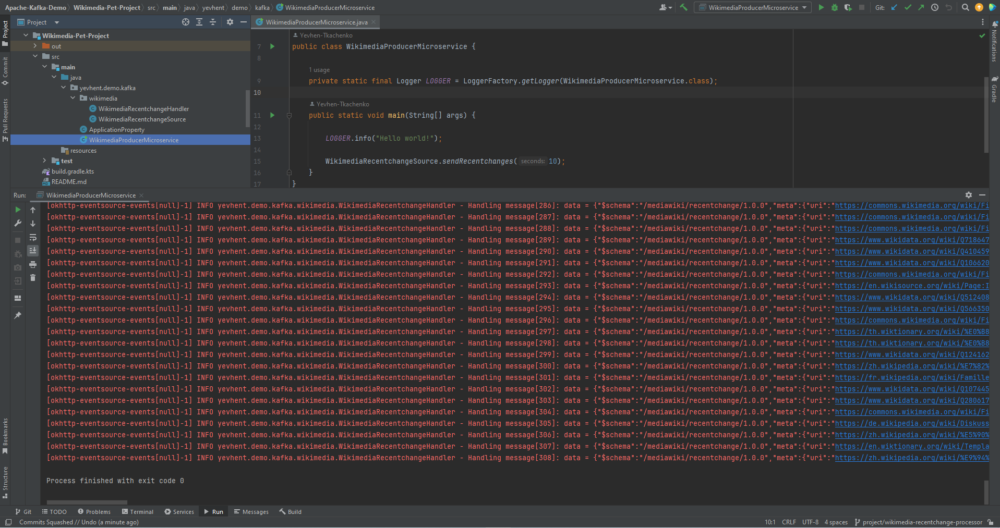

# Wikimedia Pet Project

1. We will use [Wikimedia Recentchange](https://stream.wikimedia.org/v2/stream/recentchange)
   as an Event Source for Kafka.
   There is [implementation](https://github.com/Yevhen-Tkachenko-1/Apache-Kafka-Demo/commit/a250c65850f8c1aa65a9cdb7bdab1811fbc9f0b0)
   of reading Events from Wikimedia by HTTP. 
   For now, we run java app for 10 seconds which just prints incoming messages to Log output.
   
   At this point project state and output looks like this:

   

   