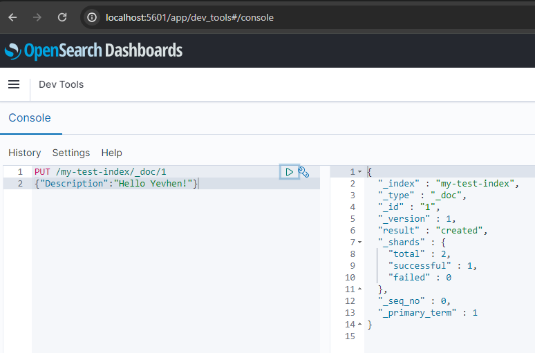

# Wikimedia Pet Project

There is work [branch](https://github.com/Yevhen-Tkachenko-1/Apache-Kafka-Demo/tree/project/wikimedia-recentchange-processor)
for Project implementation.

1. We will use [Wikimedia Recentchange](https://stream.wikimedia.org/v2/stream/recentchange)
   as an Event Source for Kafka.
   There is [implementation](https://github.com/Yevhen-Tkachenko-1/Apache-Kafka-Demo/commit/a250c65850f8c1aa65a9cdb7bdab1811fbc9f0b0)
   of reading Events from Wikimedia by HTTP. 
   For now, we run [java app](Recentchange-Producer-Microservice/src/main/java/yevhent/project/wikimedia/producer/WikimediaProducerMicroservice.java)
   for 10 seconds which just prints incoming messages to Log output.
   
   At this point project state and output looks like this:

   

2. Having Kafka services running (as described [here](../README.md))
   let's create new topic `wikimedia.recentchange` for this project:

   run `kafka-topics.sh --bootstrap-server [::1]:9092 --topic wikimedia.recentchange --create --partitions 3 --replication-factor 1`

   then check:

   run `kafka-topics.sh --bootstrap-server [::1]:9092 --list`

   Now, we are ready to Produce Events from Wikimedia to our Kafka server.

   There is current [implementation](https://github.com/Yevhen-Tkachenko-1/Apache-Kafka-Demo/commit/3b0ee6dabebb2a9819874c379e08e2317ff8bf18)

   For now, we run [java app](Recentchange-Producer-Microservice/src/main/java/yevhent/project/wikimedia/producer/WikimediaProducerMicroservice.java)
   for 10 seconds which reads Events from Wikimedia by HTTP and produces parsed data to Kafka topic.

   At this point project state and output looks like this:

   
   
   Additionally, we can check persistence of Events in Topic using CLI:

   run `kafka-console-consumer.sh --bootstrap-server [::1]:9092 --topic wikimedia.recentchange --property print.partition=true --from-beginning`

   Output looks like this:

   

3. Now, we are going to setup and run Opensearch service using Docker:
 
   - Install Docker Desktop as described [docs for Windows](https://docs.docker.com/desktop/install/windows-install/)
   - Run [docker-compose file](Recentchange-Consumer-Microservice/docker-compose.yml). 
     
     Output should be like this:
     

   - Try if it works by http://localhost:9200:
   
   - And check Dashboards http://localhost:5601:
   

4. At this point we are ready to work with Opensearch. 
    
   Let's try to use CRUD operations using UI.

   First, we create index:
   
  
   Then for that index, we create document with id 1 and content as JSON text: 
   
   
   Then we check if document is saved:
   
   
   Now we want to clean up our data:
   
   
   Finally, delete index:
   

   
     
   