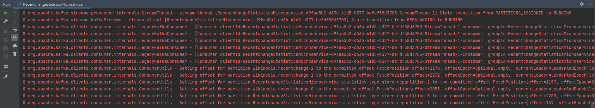

# Wikimedia Pet Project

There is
work [branch](https://github.com/Yevhen-Tkachenko-1/Apache-Kafka-Demo/tree/project/wikimedia-recentchange-processor)
for Project implementation.

1. We will use [Wikimedia Recentchange](https://stream.wikimedia.org/v2/stream/recentchange)
   as an Event Source for Kafka.
   There
   is [implementation](https://github.com/Yevhen-Tkachenko-1/Apache-Kafka-Demo/commit/a250c65850f8c1aa65a9cdb7bdab1811fbc9f0b0)
   of reading Events from Wikimedia by HTTP.
   For now, we
   run [java app](Recentchange-Producer-Microservice/src/main/java/yevhent/project/wikimedia/RecentchangeProducerMicroservice.java)
   for 10 seconds which just prints incoming messages to Log output.

   At this point project state and output looks like this:

   

2. Having Kafka services running (as described [here](../README.md))
   let's create new topic `wikimedia.recentchange` for this project:

   run `kafka-topics.sh --bootstrap-server [::1]:9092 --topic wikimedia.recentchange --create --partitions 3 --replication-factor 1`

   then check:

   run `kafka-topics.sh --bootstrap-server [::1]:9092 --list`

   Now, we are ready to Produce Events from Wikimedia to our Kafka server.

   There is
   current [implementation](https://github.com/Yevhen-Tkachenko-1/Apache-Kafka-Demo/commit/3b0ee6dabebb2a9819874c379e08e2317ff8bf18)

   For now, we
   run [java app](Recentchange-Producer-Microservice/src/main/java/yevhent/project/wikimedia/RecentchangeProducerMicroservice.java)
   for 10 seconds which reads Events from Wikimedia by HTTP and produces parsed data to Kafka topic.

   At this point project state and output looks like this:

   

   Additionally, we can check persistence of Events in Topic using CLI:

   run `kafka-console-consumer.sh --bootstrap-server [::1]:9092 --topic wikimedia.recentchange --property print.partition=true --from-beginning`

   Output looks like this:

   

3. Now, we are going to setup and run Opensearch service using Docker:

    - Install Docker Desktop as described [docs for Windows](https://docs.docker.com/desktop/install/windows-install/)
    - Run [docker-compose file](Recentchange-Consumer-Microservice/docker-compose.yml).

      Output should be like this:
      

    - Try if it works by http://localhost:9200:
      
    - And check Dashboards http://localhost:5601:
      

4. At this point we are ready to work with Opensearch.

   Let's try to use CRUD operations using UI.

   First, we create index:
   

   Then for that index, we create document with id 1 and content as JSON text:
   

   Then we check if document is saved:
   

   Now we want to clean up our data:
   

   Finally, delete index:
   

5. Let's try to programmatic access to Opensearch.
   We have to create Index to write to Opensearch.
   Run
   this [class](Recentchange-Consumer-Microservice/src/main/java/yevhent/project/wikimedia/OpensearchInitializer.java)

   Output looks like this:

   

6. We are ready to bring things together.

   First, run
   this [microservice](Recentchange-Consumer-Microservice/src/main/java/yevhent/project/wikimedia/RecentchangeConsumerMicroservice.java)
   which will be waiting for Events to consume from Kafka and send to OpenSearch.

   Then, run
   this [microservice](Recentchange-Producer-Microservice/src/main/java/yevhent/project/wikimedia/RecentchangeProducerMicroservice.java)
   which pulls Events from Wikimedia site and send them to Kafka.

   We've already observed Recentchange producing.
   So, now let's see consuming, output looks like this:

   

7. Let's check if we have it in OpenSearch using dashboard:

   

   There is `rXZZO5AB1N-pmqDzXS1_` as id given from console output for the last record.

#### Data consistency improvement: Idempotency

So far we send event to OpenSearch just as content which may lead to data duplication.
In case we have issues with Kafka offsets, nothing prevents us to write the same Event twice to OpenSearch.
We can deal with it by sending id along with Event content.

In code, implementation looks like this:

Now, in console we have such output:

As we can see (for example for the latest Event) , _`doc` is `af8fcad2-874d-4cc6-b1c6-a0971db300cf`
which comes from `WikimediaRecentchange` data, extracted from `meta` content, `id` field.
Unlike generated `id` by OpenSearch, this `id` is from Event itself, so also unique for our business case.
Now, when we try to send the same Event to OpenSearch, it's updated which is correct behaviour.

#### Custom commit management

As for production system, we're not going to rely on default offset commitment.
So, for our Consumer we have next settings:

- `enable.auto.commit = false`
- `auto.offset.reset = latest`

This means no offset commit happens when we pool events or closing Consuming.
With such behaviour our Consumer when start running will have:

- no offset saved
- reset offset to latest
- reading new Event (on the fly) only

This makes some sense, but also may lead to data loss.
To avoid automatic offset reset, we have to add commitment in our code:

Now, we have improved flow between services.

First we can run
Producer [microservice](Recentchange-Producer-Microservice/src/main/java/yevhent/project/wikimedia/RecentchangeProducerMicroservice.java),
and wait for him to finish:

Then we are good to run
Consumer [microservice](Recentchange-Consumer-Microservice/src/main/java/yevhent/project/wikimedia/RecentchangeConsumerMicroservice.java)
which have previously saved offset, so detects new Events:

#### Kafka Streams API

Kafka Streams is build in solution that helps maps Events from one Topic to another.
We could do it by creating custom Consumer and Producer, but let's check easy way:

Start this
Streams [microservice](Recentchange-Statistics-Streams/src/main/java/yevhent/project/wikimedia/.java)
which will be waiting for new Events to map:

As we can see, it handles offsets by its own.

Then start our previously implemented
Producer [microservice](Recentchange-Producer-Microservice/src/main/java/yevhent/project/wikimedia/RecentchangeProducerMicroservice.java)

Its output looks like:

There we can see `type` field which we use as statistics to collect with Kafka Streams.

Then in Streams output we start observing next counting:

We can double-check if Topic for statistics was automatically created and populated using CLI commands.

First check all Topics by following:

run `kafka-topics.sh --bootstrap-server [::1]:9092 --list`

Output:

| topic                                                                |
|----------------------------------------------------------------------|
| RecentchangeStatisticsMicroservice-statistics-type-store-changelog   |
| RecentchangeStatisticsMicroservice-statistics-type-store-repartition |
| __consumer_offsets                                                   |
| first_topic                                                          |
| wikimedia.recentchange                                               |
| wikimedia.recentchange.statistics.type                               |

Now let's check properties of our target Topic `wikimedia.recentchange.statistics.type`:

run `kafka-topics.sh --bootstrap-server [::1]:9092 --topic wikimedia.recentchange.statistics.type --describe`

Output:

|                                               |                                 |                   |                      |          |
|-----------------------------------------------|---------------------------------|-------------------|----------------------|----------|
| Topic: wikimedia.recentchange.statistics.type | TopicId: UaDUWyFyQJ2xFXpxL8SYdA | PartitionCount: 1 | ReplicationFactor: 1 | Configs: |

|                                               |              |           |             |        |
|-----------------------------------------------|--------------|-----------|-------------|--------|
| Topic: wikimedia.recentchange.statistics.type | Partition: 0 | Leader: 0 | Replicas: 0 | Isr: 0 |

Then consume events from it:

run `kafka-console-consumer.sh --bootstrap-server [::1]:9092 --topic wikimedia.recentchange.statistics.type --property print.timestamp=true --property print.partition=true --property print.offset=true --property prin
t.key=true --property print.value=true --from-beginning`

Output:

| timestamp                | partition   | offset    | key        | value               |
|--------------------------|-------------|-----------|------------|---------------------|
| ...                      | ...         | ...       | ...        | ...                 |
| CreateTime:1715873430011 | Partition:0 | Offset:12 | new        | {"new":144}         |
| CreateTime:1715873436869 | Partition:0 | Offset:13 | categorize | {"categorize":1086} |
| CreateTime:1715873444213 | Partition:0 | Offset:14 | edit       | {"edit":2283}       |
| CreateTime:1715873452693 | Partition:0 | Offset:15 | edit       | {"edit":2703}       |
| CreateTime:1715873458901 | Partition:0 | Offset:16 | log        | {"log":186}         |
| CreateTime:1715873466165 | Partition:0 | Offset:17 | new        | {"new":153}         |
| CreateTime:1715873470981 | Partition:0 | Offset:18 | categorize | {"categorize":1313} |

     
   